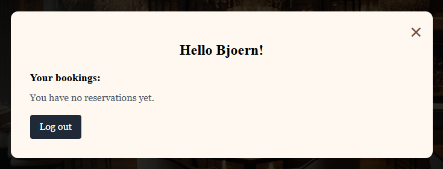

# Bite – Restaurant booking system 🍽️

 

**Live version**:  
<a href="https://my-restaurant-booking-project-9719877ce119.herokuapp.com/">Restaurant Page</a>  

## Table of contents:

* [About the project](#-about-the-project)
* [User experience](#user-experience)
    * [User Stories](#user-stories)
    * [UX-design](#-ux--design)
        * [1.Font](#1-font)
        * [2.Logo](#2-logo)
        * [3.Color Scheme](#3-color-scheme)
        * [4.Geometry Layout](#4-geometry--layout)
        * [5.Wireframing & Proposed / Implemented Functionality per Page](#5-wireframing--proposed--implemented-functionality-per-page)
* [Technologies used](#️-technologies-used)
* [Deployment & Security](#-deployment--security)
* [Features](#features)
* [Future Features](#future-features)
* [Testing](#testing)
* [Found Bugs & Fixes](#found-bugs--fixes)
    * [1.Popup did not block the content behind](#1-popup-did-not-block-the-content-behind)
    * [2.Z-index issue with logo in mobile mode](#2-z-index-issue-with-logo-in-mobile-mode)
    * [3.Error messages were not displayed on form errors](#3-error-messages-were-not-displayed-on-form-errors)
    * [4.Contact form closed regardless of result](#4-contact-form-closed-regardless-of-result)
    * [5.Scrolled to the wrong section in the hamburger menu](#5-scrolled-to-the-wrong-section-in-the-hamburger-menu)
* [Conclusion](#conclusion)
* [Thanks to](#thanks-to)
## About the project

Bite is a full-stack web application developed for a modern restaurant experience. The application makes it easy for both new and returning guests to interact with the restaurant digitally – directly via the website. The focus has been on user experience (UX), responsive design and interactive functionality.

- Book a table directly via a convenient pop-up form placed on top of the page for increased accessibility.
- Create an account or log in to access personalized functionality.
- View your own reservations, including the ability to cancel directly in a user-friendly pop-up window.
- Read menus and wine lists in separate pop-ups with a clear structure, inspired by fine-dining aesthetics.
- Send messages to the restaurant via a contact form with confirmation and automatic reset.

## User experience:
👥 User Stories:

🧑‍🍳 Visitor (Guest)

As a visitor, I want to be able to book a table online so that I can secure a seat when I visit.

As a visitor, I want to be able to see the restaurant's menu and drink selection so that I can plan my order in advance.

As a visitor, I want to be able to contact the restaurant via a form so that I can ask questions or provide feedback.

As a visitor, I want to be able to see the restaurant's opening hours and contact information so that I know when and how to visit.

As a visitor, I want to be able to see pictures of the restaurant so that I can get a feel for the atmosphere.

🧾 Registered User
As a registered user, I want to be able to log in to my account so that I can manage my bookings.

As a registered user, I want to be able to see my past and upcoming bookings so that I have an overview of my reservations.

As a registered user, I want to be able to cancel a booking so that I can change my plans if necessary.

As a registered user, I want to be able to update my account details so that my information is up to date.

As a registered user, I want to be able to log out of my account so that my information remains secure.

🧑‍💼 Restaurant Owner / Administrator
As an administrator, I want to be able to manage reservations via an admin panel so that I can organize the restaurant's schedule efficiently.

As an administrator, I want to be able to update the menu and beverage offerings so that the information on the website is up-to-date.

As an administrator, I want to be able to view and respond to messages from the contact form so that I can communicate with customers.

As an administrator, I want to be able to manage user accounts so that I can assist customers when needed.

As an administrator, I want to be able to view statistics on reservations so that I can make informed decisions about the business.

👨‍💻 Developer
As a developer, I want to be able to implement a responsive design so that the website works well on all devices.

As a developer, I want to be able to use the Django framework to structure the backend logic efficiently.

As a developer, I want to be able to use Git and GitHub for version control so that I can track changes and collaborate with others.

As a developer, I want to be able to deploy the website via Heroku so that it is available to users online.

As a developer, I want to be able to write unit tests to ensure that the functionality works as expected.

## UX & Design 

### 1. Font

The project uses Google Fonts to create a modern yet elegant feel:
- Poppins - used for body text – a sans-serif font that is stylish and easy to read.
- Playfair Display - used for headlines – a serif font that adds personality and a touch of luxury.

### 2. Color Scheme

The color palette is chosen to create a warm and inviting experience that suits an exclusive restaurant environment:
- Background: Dark tones (black / dark gray) for elegance.
- Text color: White for high contrast and readability.
- Accent colors: Natural shades of beige, brown and champagne to enhance the feeling of harmony, balance and exclusivity.

| **Purpose**       | **Hex Code** | **Preview**                                  | **Description**                                                                 |
|------------------|--------------|----------------------------------------------|---------------------------------------------------------------------------------|
| Background        | `#000000`    |  | Elegant black that creates depth and contrast to text and elements.           |
| Primary Text      | `#ffffff`    |  | White text for clear readability on a dark background.                               |
| Accent (Champagne)| `#c2b280`    |  | A warm champagne tone that signals exclusivity and is used sparingly.       |
| Soft Brown        | `#a1866f`    |  | Neutral soft brown color that provides balance between sections.                      |
| Success (Green)   | `#16a34a`    |  | Green color is used for confirmations (ex: "Booking registered!").               |
| Error (Red)       | `#dc2626`    |  | Red is used for error messages in forms.                                     |
| Button Black      | `#000000`    |  | Used in buttons like "Reservation", "Login", etc., for a uniform expression. |

### 3. Logo
The logo (“logo-bite”) is centrally positioned and responsive.
- It is clearly displayed on larger screens but is automatically hidden during pop-up activities and mobile menus so as not to block features.
- The image is vector-based and adapted to maintain high quality in all resolutions.  

### 4. Geometry / Layout
- Grid structure: Flexbox is used to create dynamic sections, centering and popup positioning.
- Carousel layout: Built with vw and vh dimensions to take up the entire screen and work smoothly on all devices.
- Popup forms: All forms (booking, contact, registration, login) are placed centrally and are overlaid with a dark background for focus.

### 5. Wireframing & Proposed / Implemented Functionality per Page
#### Wireframes
Wireframes were developed at an early stage to guide layout decisions and interaction flows. These were iteratively refined as the project evolved.

#### Screens include:
- Landing page
- Carousel section
- Popups for forms (booking, login, registration, contact)
- Mobile layout with menu navigation

## Implemented Functionality per Section
### Home Page
- Contains welcome message and hero image
- Entry point to carousel and navigation

#### Carousel Section
- Fullscreen image carousel that allows horizontal navigation via arrows  
   
- Each slide displays themed content, including food and drink menus

#### Popup Forms
- Booking, contact, registration, and login forms are implemented as modals
- Appear centered on top of all content with a dark overlay for focus
- Close on outside click or close button
- Designed for both desktop and mobile   

#### Mobile-Friendly Layout
- Fully responsive design using media queries
- Navigation adapts to smaller screens
- Popup forms and overlays function identically on mobile

#### Overlay Menus & Contact Forms
- Menus and wine list presented in fullscreen modal overlays
- Contact form uses similar design and interaction pattern
- All overlays block background interaction while active

#### "My Side" – Logged-In User View
- Personalized view showing user's current and past bookings
- Allows for direct cancellation of bookings
- Conditional rendering of content based on authentication status  

## Technologies used

#### Languages & Frameworks

- **HTML5, CSS3, JavaScript (ES6),** – Used to structure, design, and create dynamic interfaces for the entire website.

- <a href="https://www.python.org/">Python</a> - Used for backend logic, form handling, validation, and interaction with the database via Django.
- <a href="https://www.djangoproject.com/">Django</a> - was used as the architectural framework for the project and follows the Model-Template-View (MTV) principle. It separates logic, database structure, and presentation, creating a clear and scalable structure for the application – perfect for a restaurant booking solution with multiple features and user flows.

#### Version Control & Deployment

- <a href="https://github.com/bjoernholmlund/project4restaurant">Github</a> - was used for version control and as a remote repository for the project's code base. It also served as a connection point to Heroku, where the latest version of the application could be automatically deployed after each push to the master branch. This enabled continuous delivery and a smooth development process.

- <a href="https://github.com/projects">GitHub Projects</a> - The project's development was structured according to an agile working method with user stories, tasks and columns (To Do, In Progress, Done) for clear traceability.

- <a href="https://www.heroku.com/">Heroku</a> - is a cloud-based Platform as a Service (PaaS) that enables easy and seamless deployment of this full-stack Django application. It handles everything from server environment to database connections and allows automatic updates directly from GitHub, making development and deployment to production fast and secure.

####  Database & Static File Management

- <a href="">PostgreSQL</a> - A free and open-source relational database management system emphasizing extensibility and technical standards compliance. Designed to handle high range of workloads including Web services with many concurrent users.

- <a href="http://whitenoise.evans.io/en/stable/">WhiteNoise</a> - Used to easily allow the Deployed project to serve it's own static files.

#### Styling & Design

- <a href="https://fonts.google.com/">Google Fonts – Poppins & Playfair Display</a> - To create a balance between modernity and elegance, two complementary fonts from Google Fonts were used:

    - Poppins – A geometric sans-serif font used for all body text and menu information. It gives a clean, airy and easy-to-read impression that works well on both small and large screens.

    - Playfair Display – A serif font used for headlines and section titles. It gives a luxurious and classic expression that reinforces the premium feel of the restaurant.

Together, these fonts create a typographic contrast that both supports the aesthetics of the page and improves readability. The combination contributes to a strong visual brand and a harmonious user experience.

- <a href="https://www.canva.com/sv_se/skapa/social-medier-grafik/">Canva – Logo Design</a> - Canva was used to create the project’s logo, logo-bite. The tool offers a simple and intuitive interface for graphic design, which made it possible to quickly create a professional and visually appealing logo that matches the restaurant’s brand. The logo is used in the header to create recognition and strengthen the identity of the site. The design is responsive and adapted for both desktop and mobile views.

- <a href="https://pixabay.com/">Pixabay</a> - All background images and some decorative elements on the page are taken from Pixabay, a platform for free images and videos with an open license (CC0). These images are free to use in both commercial and non-commercial projects without requiring attribution - but as a sign of respect and transparency, the source is mentioned here.

    - Pixabay was used to:

        - Create visually strong sections in the image carousel.
        - Strengthen thematic parts of the menu (for example, dessert and drink images).
        - Contribute to the overall experience of a professional and atmospheric restaurant website.

The images have been carefully selected to match the restaurant's aesthetic, adjusted in size and in some cases edited with vignetting and color filters to create a unified design.

- <a href="https://freebiesupply.com/blog/css-arrows/">Arrows</a> - The left and right arrow icons in the image carousel are inspired by this resource. They were adapted and integrated with custom SVG styling to blend into the design and provide a smooth navigation experience between slides. The arrows are responsive, accessible, and work on both desktop and mobile devices.

#### Forms & Interactivity

- <a href="https://pypi.org/project/django-widget-tweaks/">Django widget tweaks</a> – This Django extension makes it possible to customize forms directly in templates using filters such as add_class, add_placeholder, etc. It enables stylistically uniform form fields without having to create custom forms from scratch.

- <a href="https://www.w3schools.com/jsref/api_fetch.asp">JavaScript Fetch API + FormData</a> – Used in all your popup forms (reservation, login, register, contact) for AJAX requests to the Django backend without reloading the page.

- JavaScript scrollIntoView() + smooth scroll - Used in the hamburger menu to smoothly scroll to the correct section of the page and create a seamless navigation.

#### Testing & Validation

-  <a href="https://validator.w3.org/">W3C HTML Validator</a>, <a href="https://jigsaw.w3.org/css-validator/">W3C CSS Validator</a> & <a href="https://jshint.com/">JSHint</a> - Used to validate and improve the quality of my code, both in terms of syntax and structure. Running HTML, CSS, and JavaScript validation ensured that the code followed standards and was free of common errors that could impact functionality or compatibility.

## Implementation and Security
#### Implementation Process

The project is hosted on Heroku, a cloud-based platform that enables smooth deployment of full-stack applications.

- Steps to deploy the project:

    - The code is versioned with Git and pushed to GitHub.
    - Heroku is connected to GitHub and configured to automatically update the project from the master/main branch.
    - In Heroku, Gunicorn is used as a WSGI server to run Django in production.
    - WhiteNoise is used to handle static files (CSS, JavaScript, images) directly from the app without an external server.
    - A PostgreSQL database is used in production, created and managed by Heroku's own resources.
    - Collectstatic is automatically run at each deployment to collect and manage static files.
    - The following files and conditions are required and used in the deployment:
    - requirements.txt – All required Python packages.
    - Profile – Specifies Heroku's startup process (web: gunicorn projectname.wsgi).
    - runtime.txt – Specifies the Python version to use (e.g. python-3.11.5).
    - env.py – Contains sensitive information, which is not pushed to GitHub.
    - settings.py – Contains dynamic handling of DEBUG, ALLOWED_HOSTS, and DATABASES depending on whether the project is running locally or on Heroku.

#### Security Considerations
- DEBUG = False in production to avoid exposing sensitive information.
- SECRET_KEY and other secret variables are stored in env.py (locally) and under Config Vars in Heroku.
- ALLOWED_HOSTS is set to only allow specific domains.
- CSRF protection is used in all Django forms.
- Error handling with try/except and fallback pages are implemented.
- All forms check user input to prevent unauthorized POST calls and broken validations.
- Django's built-in authentication is used, which protects against common vulnerabilities such as SQL Injection and XSS. 

## Features

This web application has been developed with a focus on user experience, smooth interactions, and a modern, responsive interface. The features are designed to make it easier for both restaurant guests and administrators – from booking tables to managing users and contact requests. Below are the core features that form the core of the project:

- Fullscreen image carousel on the landing page for a visually appealing first impression
- Popup forms for booking, login, registration and contact, integrated into the interface
- User authentication (login/logout) with feedback and protected views
- Booking system with double booking control and cancellation option
- Admin panel via Django for managing bookings and users
- Responsive layout that adapts to desktop, tablet and mobile
- AJAX-based forms that are submitted without page loading for a smooth user experience
- Dynamic menus and drink lists displayed in modal overlays
- Conditional display of content depending on whether the user is logged in or not
- Contact form with validation and feedback to the user after submitting a message

## Future Features
This project is intended to continue to evolve over time, with several planned improvements and new features aimed at creating even greater value for both guests and administrators. Below is an overview of features planned or being considered for future releases:

- ✉️ Email confirmations for bookings for increased security and clear communication

- 📊 Admin dashboard with booking statistics and user insights

- 📅 Responsive calendar overview to show available times directly

- 👤 User profile page where registered users can change their details

- 🌐 Multi-language support (e.g. switching between Swedish and English)

- ⭐ Review system where guests can leave feedback after their visit

## Testing
The project has undergone extensive manual testing to ensure a stable, responsive, and user-friendly experience across devices and scenarios. The focus has been on testing everything from form flows and popup behavior to backend logic and security. Validation tools have been used to maintain high code quality, and Django's built-in error handling and security features have been confirmed to work as expected.

Below are the most important testing steps:

- 📱 Manual testing on mobile, tablet and desktop with different screen sizes

- ✅ Form validation tested with invalid, empty and incorrect inputs

- 🔁 Navigation and scrolling behavior verified on all devices

- 🪟 Popup behavior tested (opening, closing, correct z-index and overlay)

- 🧩 Django backend tested with different user flows: booking, login, registration, cancellation

- 🧰 Code validation performed with tools such as:

    - W3C Markup Validator for HTML

    - W3C CSS Validator

    - JSHint for JavaScript

- 🛡️ Django CSRF protection tested, including error handling and feedback

- 🧪 Where applicable: Automatic tests have been written in tests.py to ensure functionality in the backend (e.g. booking flow, model validations and views)

## Found Bugs & Fixes
### 1. Popup did not block the content behind
#### Problem:
When using popup forms (e.g. booking or registration), the user could still click on menus and buttons in the background, which created unwanted behavior – for example, other popups opened at the same time or the user navigated away from the input in progress.
#### Solution:
I introduced a `
` that is placed below the popup but on top of all other content. It has `position: fixed`, `top: 0`, `left: 0`, `width: 100vw`, `height: 100vh`, `background-color: rgba(0,0,0,0.5)` and `z-index: 40`. The overlay is activated via JavaScript `(style.display = "block")` at the same time as the popup is displayed, and is closed at the same time as it is.
#### Lesson learned:
To create focused user flows with modals, both visual separation (dark background) and the page behind it are required to be non-interactive. Overlay is a simple but powerful tool for this.

### 2. Z-index issue with logo in mobile mode
#### Problem:
When popup forms were displayed in mobile mode, the logo (logo-bite) was still at the top of the page. This resulted in the popup's close cross not being clickable, or it visually disrupted the layout.
#### Solution:
I added a rule to the CSS:

    body.menu-open .logo-bite,
    body.menu-popup-open .logo-bite,
    body.drink-popup-open .logo-bite
    body.contact-popup-open .logo-bite{
        display: none;
    }
This class `(popup-open)` is toggled via JavaScript every time a popup is opened/closed. This way, the logo is automatically hidden when a popup is active.
#### Lesson learned:
Responsive design is not just about visually-adapted layout – you also have to think about function and z-index hierarchy. Especially when working with `position: fixed` and different screen sizes.

### 3. Error messages were not displayed on form errors
#### Problem:
If a form (such as contact or reservation) was submitted with invalid data – e.g. without an email address or with an already booked time – Django returned an error, but no visual feedback was shown to the user.
#### Solution:
I added a `div#reservationMessage` and handled the response via JavaScript with `fetch()`. The `then()` chain checks if `data.success === false`, and if so, displays a red error message with `innerHTML`, as well as any time suggestions in buttons that the user can click to change their reservation.
#### Lesson learned:
Effective error handling in the frontend leads to better UX. It is not enough for the backend to react correctly – the user needs to get clear visual feedback right away.

### 4. Contact form closed regardless of result
#### Problem:
After submitting the contact form, the popup automatically closed after 3 seconds – even if an error occurred (e.g. empty message or server error). This could confuse the user who thought the message had been sent.
#### Solution:
I changed `setTimeout(() => closeContactPopup(), 3000);` to only run if `data.success === true`. This way, the popup will only close if the server confirms that the message was sent.
#### Lesson learned:
The user experience should be driven by the result, not just a timeout command. Listening to backend responses makes the interface more intuitive and reliable.

### 5. Scrolled to the wrong section in the hamburger menu
#### Problem:
When clicking on e.g. “Menu” in the hamburger menu in mobile mode, the page did not scroll correctly to the correct section. Often it stopped above or below the actual section.
#### Solution:
I replaced `href="#carousel-section"` with a `scrollIntoView()` function in JavaScript that is activated via `addEventListener("click")`. I also added `behavior: "smooth"` and ensured that the menu was closed with `.classList.remove("active")`.
#### Lesson learned:
Built-in `href="#..."` does not always work as well in combination with fixed headers or mobile-friendly layouts. Direct control with JavaScript provides more precision and better control over the user's movement on the page.

## Conclusion
Bite is a full-stack project developed with the goal of offering a modern, elegant and user-friendly online restaurant experience. By combining technologies such as Django, JavaScript and responsive design, a completely digital booking flow has been created where users can easily book tables, view menus, log in and manage their bookings.

The project has given me the opportunity to apply both front-end and back-end skills in practice, with a focus on user experience, interaction and accessibility. Great emphasis has been placed on testing, security and code structure – making the solution both stable and scalable for future development.

This project reflects my journey as a developer and is a testament to what I have learned in web development. The work on Bite is not finished – there are many exciting features planned for the future, and I look forward to continuing to build on it.

### Thanks to
- Code Institute – for a structured and educational training that has provided the foundation for this project.
- The Slack community – for quick support, inspiration and guidance during coding and debugging.
- GitHub and Stack Overflow – for technical solutions, examples and discussions that helped solve specific problems.
- W3C, JSHint – for available validation tools that helped me write clean and correct code.
- Pixabay & Canva – for high-quality images and tools that contributed to the visual identity of the project.